# Stremio Cinema for Home Assistant

[](https://www.hacs.xyz/docs/faq/custom_repositories/)
[](https://github.com/jjohnreese/hacs-stremio/releases/tag/v0.6.0)
[](https://www.home-assistant.io/)
[](https://github.com/jjohnreese/hacs-stremio/actions/workflows/cinema-regressions.yml)

**Browse. Discover. Organize. Pick up where you left off.**

Bring your Stremio library into Home Assistant with a Cinema dashboard, movie and series discovery, public title information, recommendations, and episode-aware watch management.

[See examples](#see-it-in-action) · [Copy a dashboard](#try-a-dashboard) · [Install](#installation) · [Card options](docs/ui.md) · [All 17 actions](docs/services.md)

## See it in action

**Explore movies and series, switch Popular/New feeds, and sort loaded titles by IMDb.**

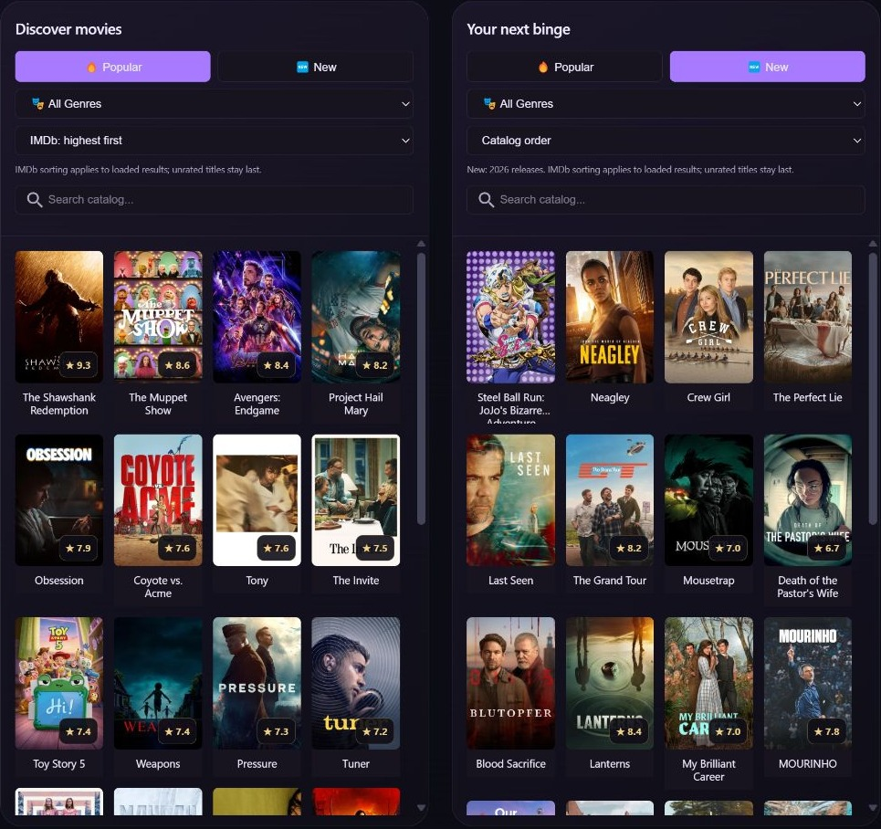

### Get to know a title

Series open their details on the **first click**. Choose **Title Info** immediately; choose an episode when you want episode-specific watch actions or streams.

| Title Info · live | First-click series menu · live |
| --- | --- |
| 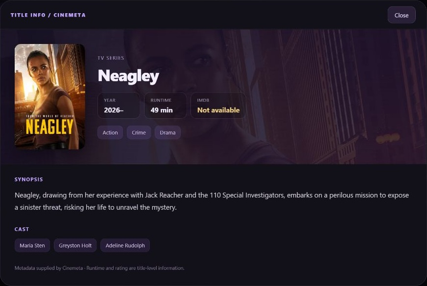 | 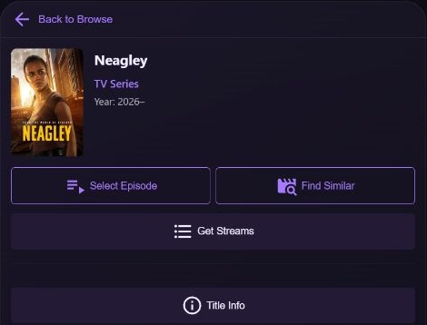 |

| Search the public catalog · live | Choose a season and episode · live |
| --- | --- |
| 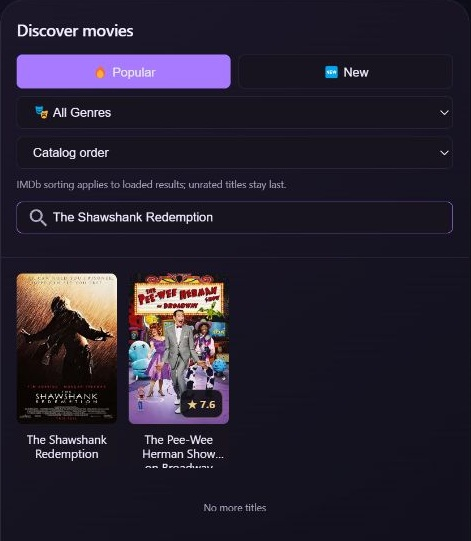 | 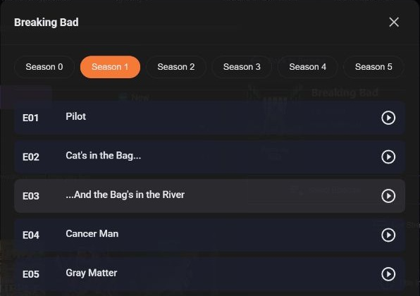 |

### Comfortable on a phone

Two poster columns, larger carousel items, wrapped titles, and touch-sized filters and actions. Your configured desktop columns remain available on larger screens.

| Discovery · demo | Library · demo | Continue Watching · demo |
| --- | --- | --- |
| 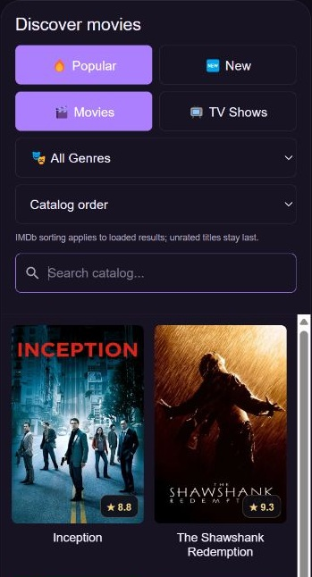 | 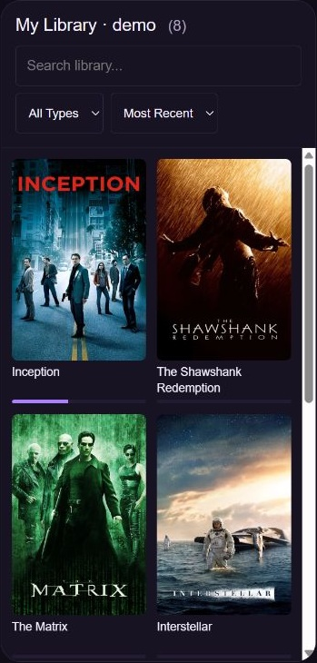 | 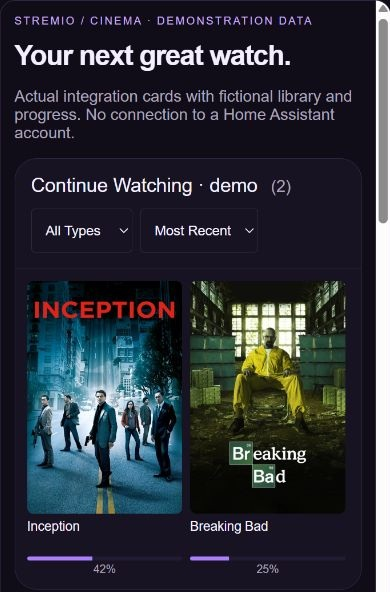 |

*Phone examples render the actual cards in a 390-pixel frame. Library contents, counts, and progress are fictional. This is a browser layout demonstration, not a screenshot from a mobile Home Assistant app.*

<details>
<summary><strong>More examples: library, recommendations, watch management, streams, and player</strong></summary>

**Continue Watching and recommendations · demonstration data**

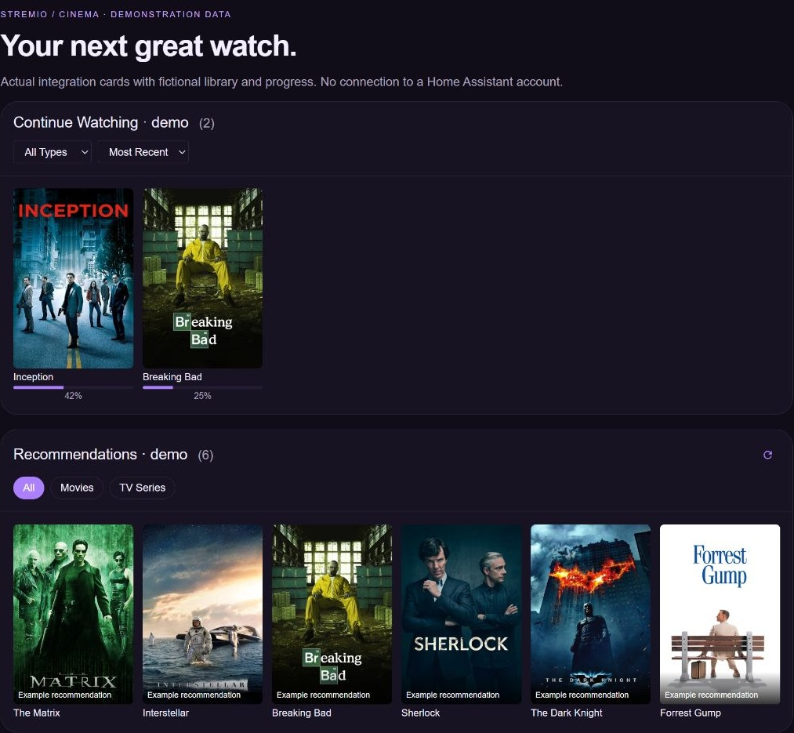

**Searchable library and the inherited player card · demonstration data**

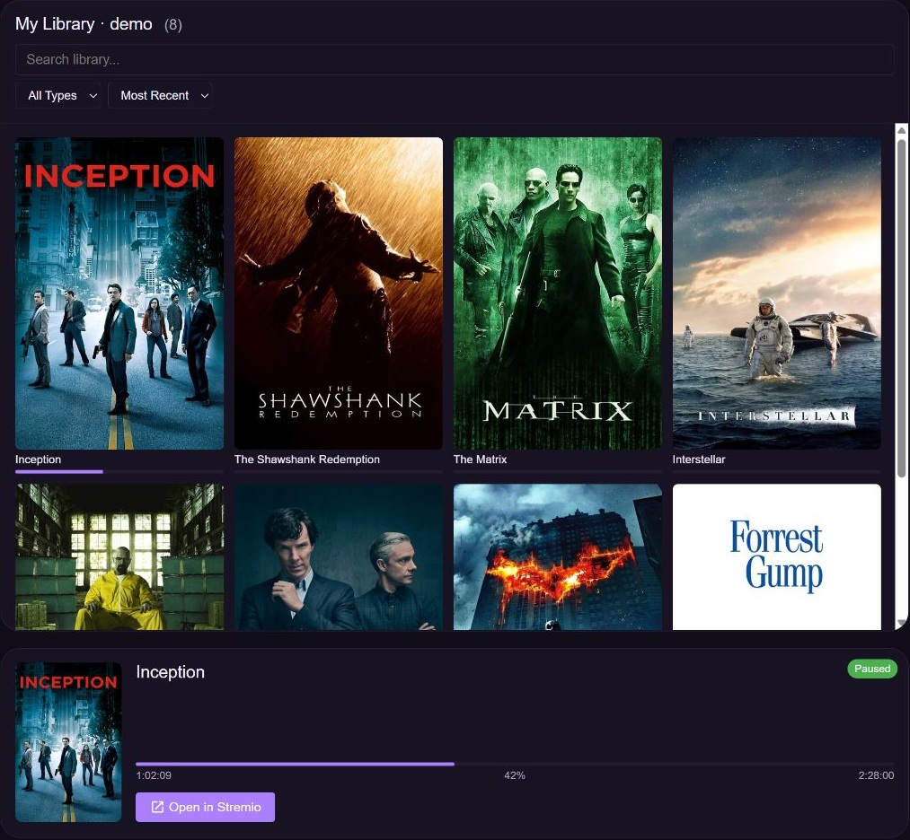

**Watch and library management · demonstration data**

Mark watched/unwatched, clear resume progress separately, and manage membership. For series, watch actions apply to the selected episode.

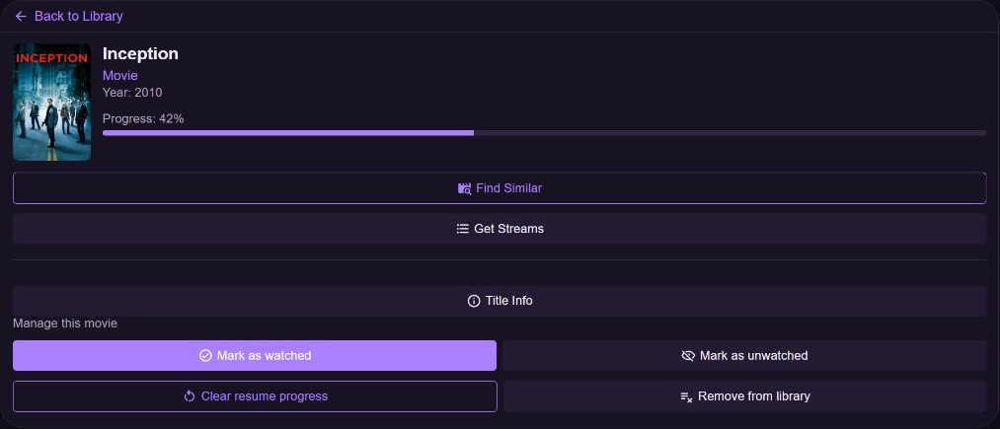

| Inspect and copy streams · demo | Find Similar · demo |
| --- | --- |
| 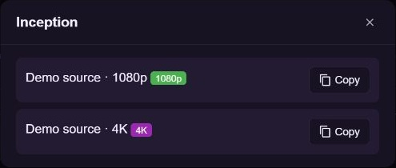 | 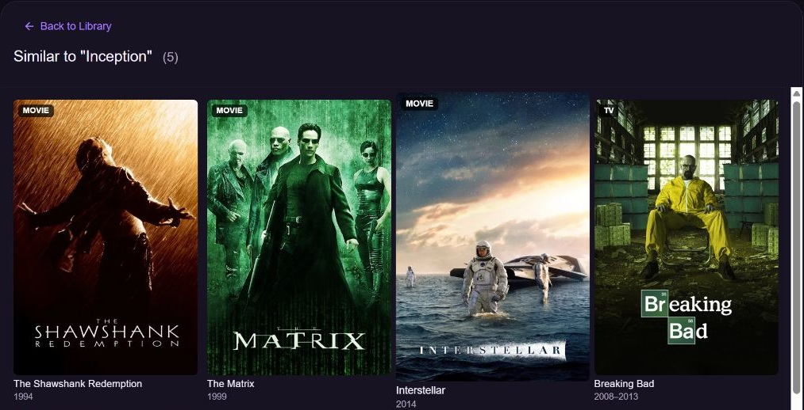 |

The stream examples use fictional URLs. Actual sources and device playback depend on your Stremio add-ons and devices. Management mode hides launch/forward controls; the inherited player, standalone Media Details card, media browser, and optional Apple TV features remain available separately.

</details>

Live screenshots above were captured after installing **0.6.0**, cropped to Stremio cards/dialogs, and reviewed individually. The [visual guide](docs/screenshots/README.md) records which views are live, which use demonstration data, and what remains untested.

## Try a dashboard

For the complete Cinema layout with its hero, statistics, discovery, recommendations, library, and refresh footer, start with the **[full dashboard YAML](examples/stremio-cinema-dashboard.yaml)** and follow [the setup steps](#your-cinema-dashboard).

<details>
<summary><strong>Copy a simpler three-card dashboard</strong></summary>

Install and configure the integration first. This starter uses only the bundled Stremio cards. Replace the three example entity IDs everywhere they appear with your own media player, Library Count sensor, and Continue Watching Count sensor. Paste into a new dashboard's Raw configuration editor; for an existing dashboard, append only the view to its current `views:` list.

```yaml
views:
  - title: Stremio Cinema
    path: stremio
    icon: mdi:movie-open
    cards:
      - type: custom:stremio-continue-watching-card
        title: Pick up where you left off
        entity: sensor.stremio_account_continue_watching_count
        library_entity: sensor.stremio_account_library_count
        management_mode: true
        horizontal_scroll: true
        tap_action: details
      - type: custom:stremio-browse-card
        title: Discover movies
        entity: media_player.stremio_account_stremio
        library_entity: sensor.stremio_account_library_count
        management_mode: true
        default_type: movie
        default_view: popular
        show_rating: true
        show_sort_controls: true
        show_load_more: true
        columns: 4
        max_items: 24
        card_height: 640
        tap_action: details
      - type: custom:stremio-library-card
        title: The collection
        entity: sensor.stremio_account_library_count
        library_entity: sensor.stremio_account_library_count
        management_mode: true
        columns: 4
        max_items: 120
        card_height: 640
        tap_action: show_detail
```

For a series catalog, change `default_type: movie` to `series`; use `default_view: new` for the current-year feed. Add `config_entry_id` to each management card when routing multiple accounts, as explained in the [dashboard guide](docs/dashboard.md).

</details>

## What you can do

The Cinema example enables **management mode**: inspect and copy stream links, organize your library, and manage watch status. Playback cards, media-source browsing, and optional Apple TV handover remain available outside management mode. This is a Home Assistant **custom integration**, installed under `custom_components/stremio`.


| Capability | What it does |
| --- | --- |
| Library | Search, filter movies/series, sort, inspect details, add and remove titles while preserving history. |
| Continue Watching | Show titles with resume progress, episode information, progress bars, and optional carousel layout. Clear resume progress separately from watched status. |
| Discovery | Browse Popular or current-year New movies and series, filter genres, search the public catalog, and load further results. |
| IMDb sorting | Show score badges and sort **loaded results** numerically, ascending or descending; unrated titles remain last. Restore provider order anytime. |
| Recommendations | Explore suggestions based on library preferences and use Find Similar from a title's details. |
| Title Info | Open a native popup with public Cinemeta synopsis, cast, director, genres, year, runtime, and score. No Browser Mod required. |
| Watch management | Mark a movie or a selected series episode watched/unwatched. Episode changes preserve other episodes and unrelated resume progress. |
| Series | Pick seasons and episodes, inspect available streams, and request upcoming episode information. |
| Streams | List sources from your Stremio add-ons and copy a selected URL. Configurable add-on ordering and quality preferences are inherited. |
| Playback | Existing player/detail cards, media browser, and optional Apple TV handover remain; external-device compatibility depends on device/app/protocol. |
| Home Assistant | Media player, library/current/last-watched/stream/resume sensors, binary sensors, refresh buttons, and playback/library events for automations. |

New means Cinemeta's **current UTC-year feed**, which can include upcoming releases. It does not mean recently added to your library or new episodes. Load More consumes native provider pages and adds smaller display batches; a sparse filtered page can need another click. IMDb sorting is not a ranking of the entire remote catalog.

## Installation

1. In HACS, open the three-dot menu → **Custom repositories**.
2. Add `https://github.com/jjohnreese/hacs-stremio`, category **Integration**.
3. Download **Stremio Cinema**, then restart Home Assistant.
4. Open **Settings → Devices & services → Add integration**, search **Stremio Cinema** (the domain remains `stremio`), and follow the Stremio sign-in flow.
5. Hard-refresh your browser after updating; embedded cards are registered automatically for storage-mode dashboards.

Manual installation: copy only `custom_components/stremio` into your Home Assistant configuration's `custom_components` directory, then restart. Never copy test fixtures, handoff notes, development config, or documentation into the component directory.

**Migrating from upstream:** back up your Home Assistant configuration, replace the existing Stremio component through HACS/manual installation, restart, and keep your existing Stremio config entry. The fork and upstream use the same domain and cannot be installed side by side. Existing entity names depend on your account and entity registry; this fork does not rename your stored entities.

See [HACS custom repository instructions](https://www.hacs.xyz/docs/faq/custom_repositories/) and [the setup guide](docs/setup.md). Credentials and Stremio session keys belong in the integration configuration, never dashboard YAML or GitHub.

## Your Cinema dashboard

The [complete, copyable dashboard](examples/stremio-cinema-dashboard.yaml) includes the hero, statistics, Continue Watching, recommendations, movie/series discovery, library, and refresh footer, with responsive desktop/mobile layouts.

1. Install **Button Card**, **Layout Card**, and **Card Mod** from HACS. The Stremio cards ship with this integration.
2. Find your actual Stremio entities under **Settings → Devices & services → Stremio Cinema → Entities**.
3. Replace **every occurrence** of these five example entities in the YAML:

| Example | Replace with |
| --- | --- |
| `media_player.stremio_account_stremio` | Your Stremio media player |
| `sensor.stremio_account_library_count` | Your Library Count sensor |
| `sensor.stremio_account_continue_watching_count` | Your Continue Watching Count sensor |
| `binary_sensor.stremio_account_has_new_episodes` | Your Has New Episodes binary sensor |
| `button.stremio_account_force_refresh` | Your Force Refresh button |

4. Create an empty dashboard under **Settings → Dashboards**, open its **Raw configuration editor**, and paste the full `views:` example. For an existing dashboard, append just the supplied view under its existing `views:` list and retain its other views.
5. Save, refresh, and open **Stremio Cinema**. For multiple accounts, set `config_entry_id` on each management card and ensure its `entity`/`library_entity` refer to the same account.

[Detailed dashboard setup, minimal cards, resource configuration, and troubleshooting](docs/dashboard.md)

## Copyable action examples

Public IMDb IDs below are examples. Replace the config-entry placeholder with your own Stremio integration entry ID; it is not an entity ID or authentication key.

```yaml
# Mark a movie watched; add it to your library first.
action: stremio.mark_watched
data:
  config_entry_id: REPLACE_WITH_STREMIO_CONFIG_ENTRY_ID
  media_id: tt1375666
  media_type: movie
```

```yaml
# Mark only Breaking Bad season 1, episode 1 as unwatched.
action: stremio.mark_unwatched
data:
  config_entry_id: REPLACE_WITH_STREMIO_CONFIG_ENTRY_ID
  media_id: tt0903747
  media_type: series
  season: 1
  episode: 1
```

```yaml
# A script sequence requesting public title information.
sequence:
  - action: stremio.get_title_metadata
    data:
      media_id: tt1375666
      media_type: movie
    response_variable: title_info
```

See [all 17 actions and their response behavior](docs/services.md), [watch-state semantics](docs/watch-management.md), and [automation examples](examples/README.md).

## Support and development

[Report a fork issue](https://github.com/jjohnreese/hacs-stremio/issues) with the integration version, relevant card configuration using fictional entities, and redacted logs. Never attach session keys, private add-on URLs, or a raw dashboard export.

Read [validation and known limitations](docs/validation.md) before relying on a feature. Backend account mutations require live verification on a consenting test account; offline regressions do not establish device compatibility. Public metadata is supplied by Cinemeta and may omit fields.

## Credits and licensing

Thank you to **[@tamaygz](https://github.com/tamaygz)** for the original integration, frontend cards, media-source support, and Apple TV work; to [AboveColin/stremio-ha](https://github.com/AboveColin/stremio-ha) for the upstream inspiration; and to Home Assistant, HACS, Stremio, and Cinemeta contributors.

This fork is maintained at **jjohnreese/hacs-stremio**. It is a community project, with no official endorsement from Home Assistant, HACS, or Stremio. The inherited README declares MIT licensing, but the imported upstream snapshot has no `LICENSE` file; [licensing provenance](docs/credits.md) records that accurately without inventing a missing upstream copyright notice.
